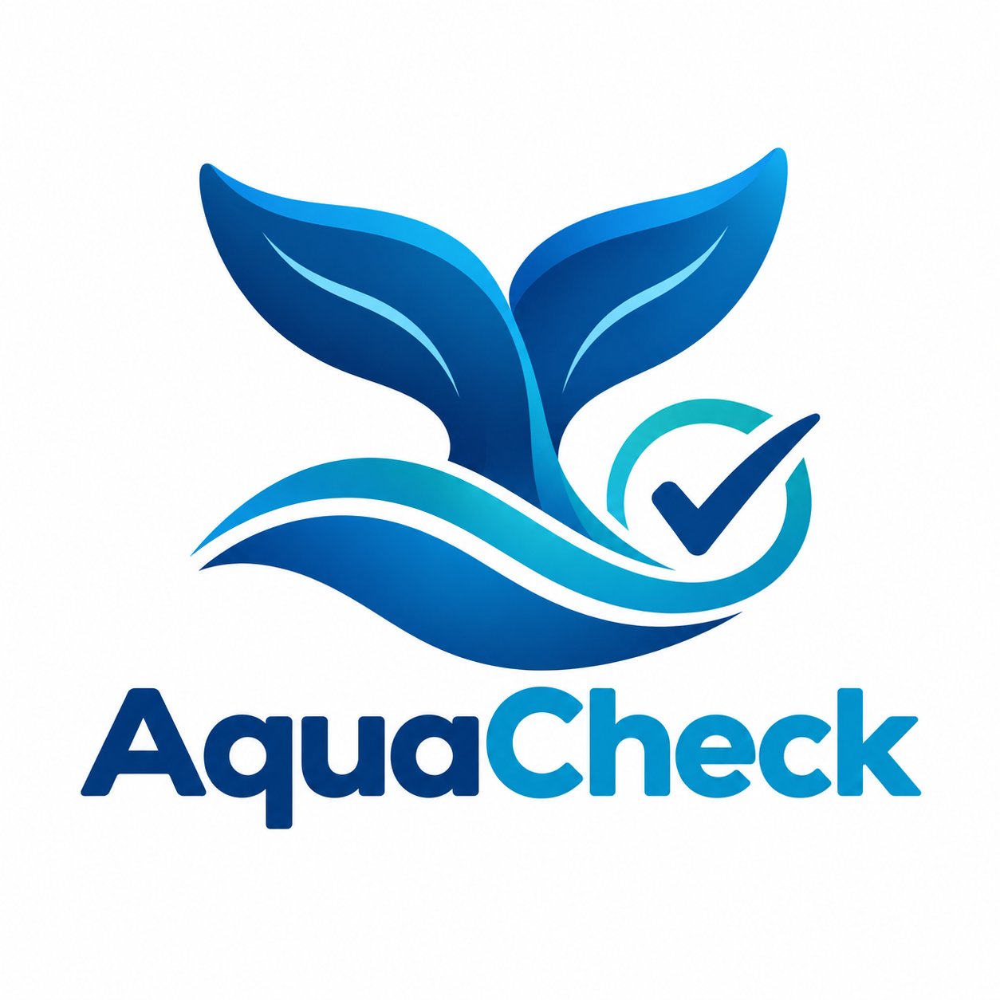
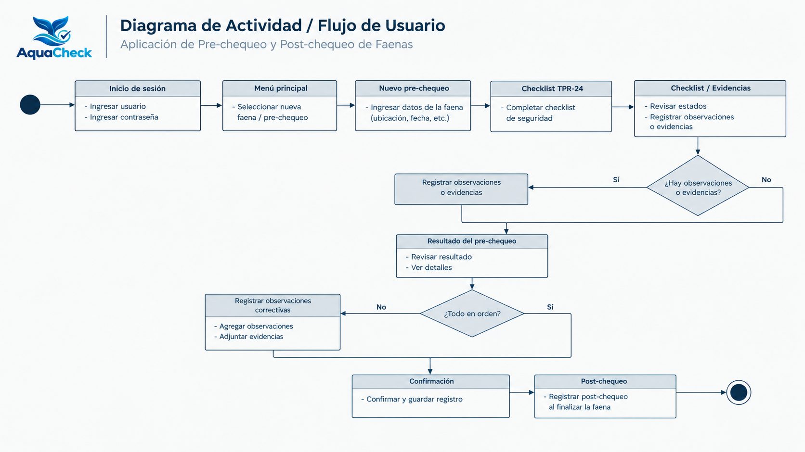

# AquaCheck 🌊

### Sistema móvil para la gestión de pre y post chequeos de seguridad en operaciones de buceo

AquaCheck es una aplicación móvil orientada a digitalizar el proceso de **pre y post chequeo de seguridad** utilizado en operaciones de buceo.

Actualmente, parte de este proceso depende de formularios en papel, revisiones manuales y registros que dificultan la trazabilidad de las faenas y la identificación oportuna de condiciones de riesgo.

AquaCheck busca centralizar este proceso mediante una aplicación móvil que permita al **Supervisor de Buceo** registrar y validar la información de cada faena, mientras que el **Administrador** podrá consultar los registros e historial de las inspecciones.

# Propósito

El propósito de AquaCheck es **digitalizar y centralizar el proceso de control de seguridad previo y posterior a una operación de buceo**, reduciendo la dependencia de registros manuales y facilitando la toma de decisiones del Supervisor de Buceo.

La aplicación permitirá registrar información de la faena, completar el checklist de seguridad basado en el estándar **TPR-24**, registrar observaciones y evidencias, visualizar el resultado del chequeo y mantener un historial de las operaciones realizadas.

# Usuarios

La aplicación contempla dos tipos de usuarios:

| Rol                     | Función                                                                                                                        |
| ----------------------- | ------------------------------------------------------------------------------------------------------------------------------ |
| **Supervisor de Buceo** | Realiza los pre y post chequeos, completa el checklist, registra observaciones y evidencias y valida el resultado de la faena. |
| **Administrador**       | Consulta el historial y revisa la información registrada de las operaciones.                                                   |

**Nota:** El buzo no utiliza directamente la aplicación. La información relacionada con la operación es registrada por el Supervisor de Buceo.

# Identidad visual

### Logotipo

El logotipo de AquaCheck representa la relación entre el **entorno acuático, la seguridad y la tecnología**, buscando transmitir confianza, control y precisión.



**Ubicación:**

```text
docs/diseno/logo-aquacheck.png
```

## Paleta de colores

| Color             | HEX       | Uso                                                     |
| ----------------- | --------- | ------------------------------------------------------- |
| Azul principal | `#006B8F` | Botones principales, encabezados y elementos destacados |
| Turquesa       | `#00A6A6` | Elementos secundarios e iconografía                     |
| Fondo           | `#F5F7F8` | Fondo general de la aplicación                          |
| Texto           | `#1F2933` | Títulos y contenido principal                           |
| Verde          | `#22C55E` | Condición segura / cumplimiento                         |
| Rojo           | `#EF4444` | Incumplimiento o condición crítica                      |

Los colores verde y rojo se utilizan principalmente para representar visualmente el estado de seguridad de los elementos revisados mediante el sistema de semáforo.

# Flujo de usuario

El flujo principal corresponde al proceso realizado por el **Supervisor de Buceo**.

### Diagrama de Actividad UML

El diagrama de actividad UML representa gráficamente el flujo principal del MVP.



---

# Pantallas principales

Las interfaces fueron definidas a partir de las funcionalidades establecidas para el MVP.

| Pantalla                       | Descripción                                                            |
| ------------------------------ | ---------------------------------------------------------------------- |
| **Inicio de sesión**           | Permite acceder a la aplicación según el rol del usuario.              |
| **Menú principal**             | Presenta las funciones disponibles según el usuario.                   |
| **Nuevo pre-chequeo**          | Permite iniciar el registro de una nueva faena.                        |
| **Checklist TPR-24**           | Permite revisar las condiciones y elementos de seguridad.              |
| **Observaciones y evidencias** | Permite registrar información adicional y evidencias de la inspección. |
| **Resultado del pre-chequeo**  | Muestra el resultado general mediante estados de cumplimiento.         |
| **Confirmación de registro**   | Informa que la información fue guardada correctamente.                 |
| **Post-chequeo**               | Permite registrar el cierre de la faena.                               |
| **Historial**                  | Permite consultar registros realizados anteriormente.                  |
| **Detalle del registro**       | Muestra la información completa de una faena seleccionada.             |

Los diseños de las interfaces se encuentran en:

```text
docs/diseno/interfaces/
```

---

# Tecnologías

| Tecnología            | Uso                                       |
| --------------------- | ----------------------------------------- |
| **Kotlin**            | Lenguaje principal de desarrollo          |
| **Android**           | Plataforma de la aplicación               |
| **Jetpack Compose**   | Construcción de interfaces                |
| **Material Design 3** | Sistema de diseño                         |
| **Git**               | Control de versiones                      |
| **GitHub**            | Repositorio y documentación               |
| **Figma / Claude**     | Apoyo en la etapa de diseño de interfaces |

# Integrantes

| Integrante | Rol | GitHub |
| ---------- | --- | ------ |
| **Sebastián Barros** | Product Owner | @sebarros |
| **Sebastián Mansilla** | Quality Assurance | @seba-l1g |
| **Alonso Contreras** | UX/UI Designer | @thealonsiiniix |

**AquaCheck — Seguridad, control y trazabilidad para operaciones de buceo.**